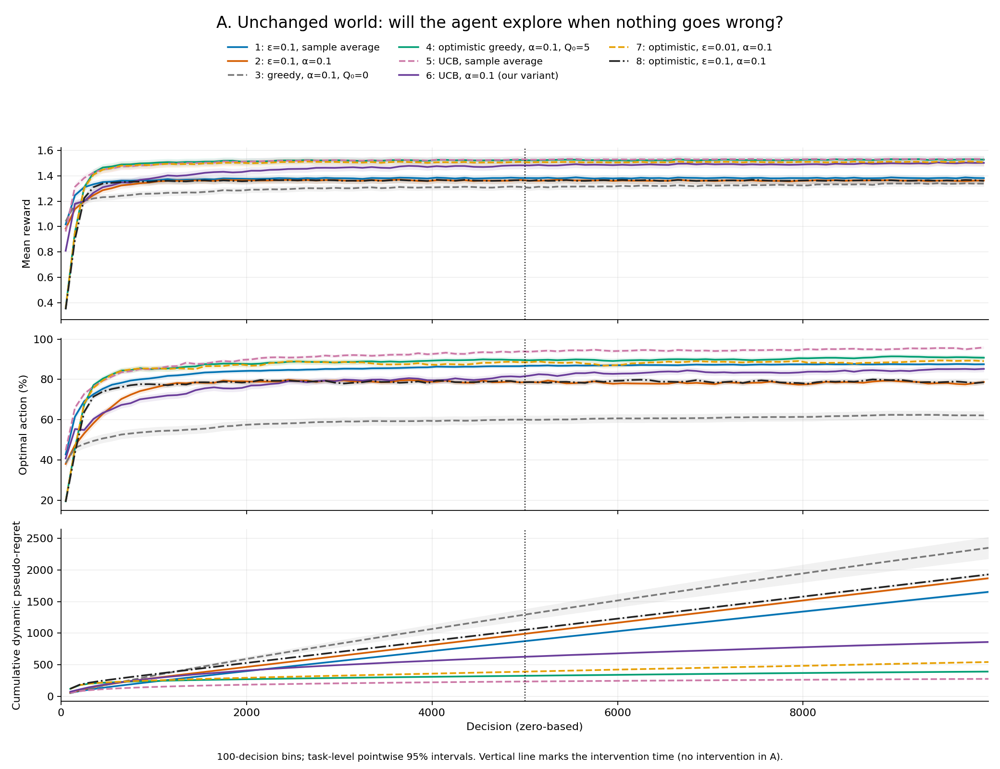
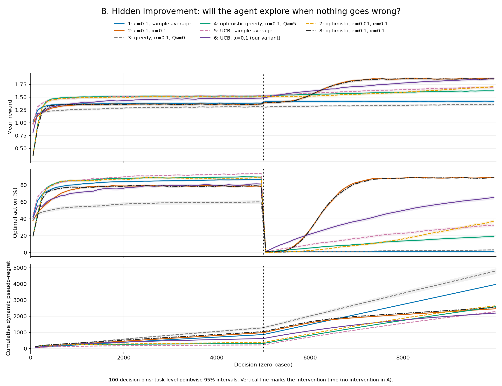
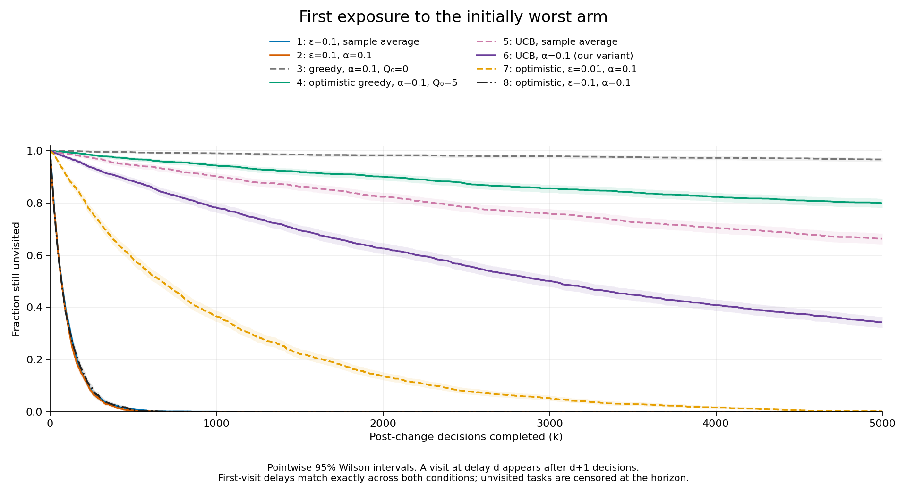
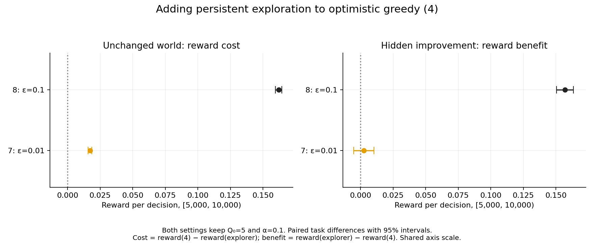
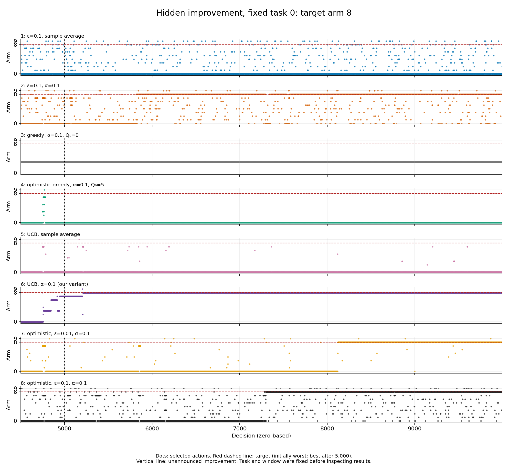
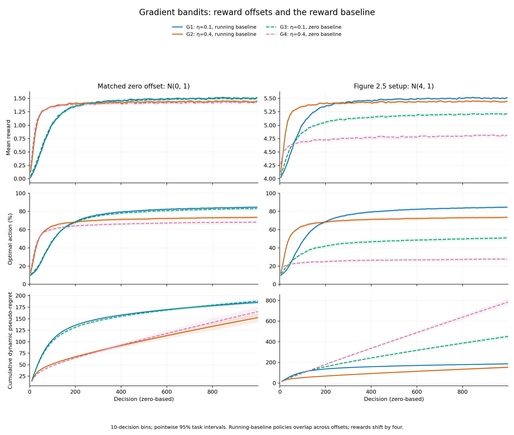
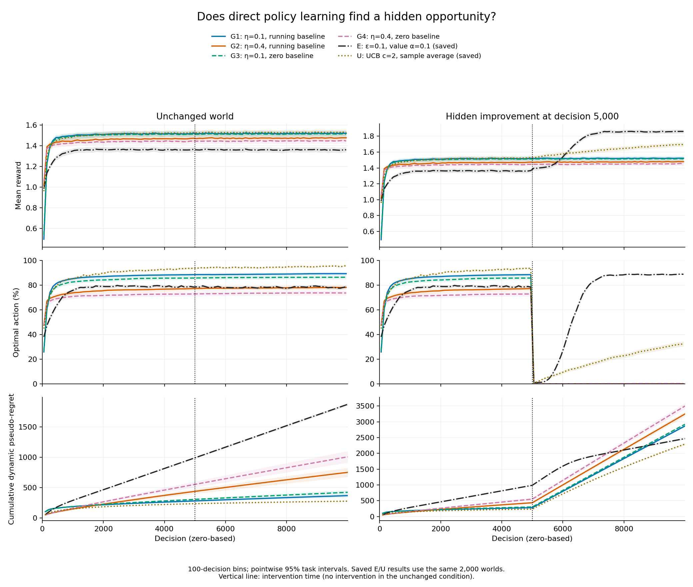
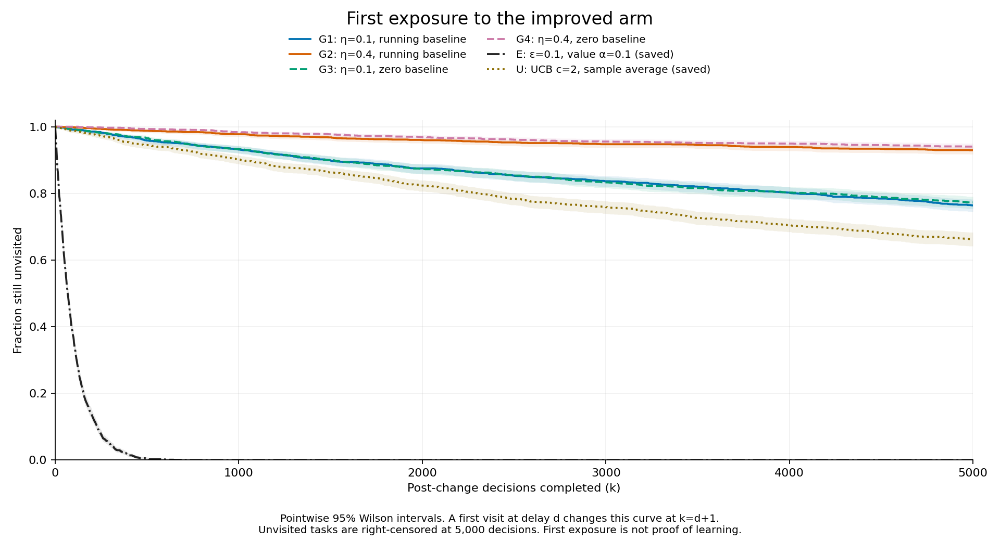
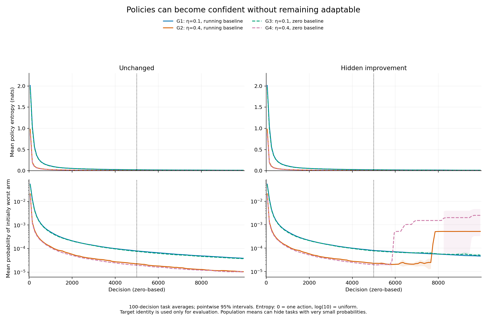
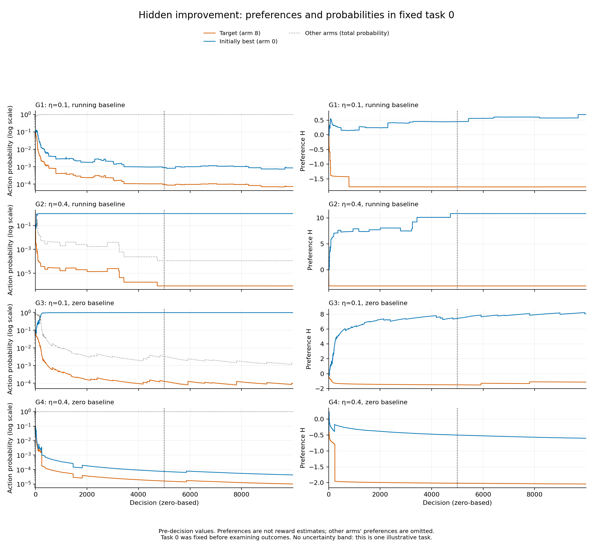

# Learning in changing worlds

**When does forgetting old experience help a learning agent adapt to a changing environment?**

This small NumPy experiment studies ten-armed bandits from Sutton and Barto,
*Reinforcement Learning: An Introduction*, second edition, Chapter 2. A learner
chooses one of ten actions, receives a noisy reward, and updates either action
values or action preferences. The aim is to understand the code and the evidence,
including where a simple learning rule fails.

**First experiments:** forgetting helped when values changed, but the amount
mattered. Of the tested methods, $\alpha=0.1$ minimized total regret in both
changing environments. Sample averages were slightly better just before the
sudden change, and $\alpha=0.5$ had the highest mean reward in the first 1,000
post-change steps. We did not measure a separate recovery time. Keeping
more history helps suppress noise; keeping less helps follow a new environment.

**Memory sweep:** the [15-condition follow-up](#our-memory-sweep-shorter-memory-or-a-noisier-world)
finds that the best tested constant rate increases with stronger drift, while
noise 2 favors smaller rates than noise 1 at the two highest drift levels.
$\alpha=0.1$ wins only 3 of 15 conditions; the pattern is conditional, not universal.

The [exploration follow-up](#our-exploration-experiment-stable-versus-changing-worlds)
asks whether exploration that works in a stable world keeps working when the
world changes. It adds optimistic initial values and UCB from Sections 2.6–2.7.
Textbook UCB has the lowest total regret in the stationary run; constant-alpha
epsilon-greedy has the lowest mean under gradual change, close to our UCB
variant. Optimistic greedy wins the sudden-change reward comparison, while
the fixed-task trace shows how it can still miss a newly best action.

The [hidden-improvement follow-up](#our-hidden-improvement-experiment-will-the-agent-explore-when-nothing-goes-wrong)
now tests a new opportunity appearing while every other arm stays unchanged.
It pairs that intervention with an unchanged control world and separates first
exposure from learning. Optimistic greedy did not revisit the target in 79.9%
of tasks during the post-change horizon. Epsilon 0.01 brought almost universal
exposure but no clear primary-regret improvement; epsilon 0.1 reduced regret
while imposing a larger reward cost in the unchanged world.

The [gradient-bandit follow-up](#gradient-bandits-do-policies-remain-adaptable-after-becoming-confident)
adds Section 2.8's direct policy learning. A running reward baseline removes
sensitivity to a matched +4 reward offset, but does not preserve exploration:
76%–94% of gradient learners never revisit the hidden opportunity, and all
four tested settings have higher post-change regret than the saved
constant-alpha epsilon-greedy and textbook UCB baselines.

### Chapter progress

| Chapter 2 topic | What we have implemented and investigated |
| --- | --- |
| Sections 2.1–2.4 | Ten-armed bandits, epsilon-greedy selection, incremental sample averages. |
| Section 2.5 | Constant-step estimates; random walks and our drift–noise memory sweep. |
| Sections 2.6–2.7 | Optimistic initialization and UCB; our permutation and hidden-opportunity comparisons. |
| Section 2.8 | [Gradient bandits](#gradient-bandits-do-policies-remain-adaptable-after-becoming-confident), softmax preferences, and reward baselines; matched reward offsets and hidden opportunities. |

## Run it

Use Python 3.10 or newer. From the repository root:

```bash
python3 -m venv .venv
source .venv/bin/activate
python -m pip install -r requirements.txt
python sanity_checks.py
python run_experiments.py
```

The final command runs all three experiments at the requested scale and writes
numerical results and PNG figures to `results/`. It overwrites files with the
same names. Plotting uses Matplotlib's noninteractive backend; no display or GPU
is needed. A small end-to-end check is available:

```bash
python run_experiments.py --smoke
python run_experiments.py --seed 20260929 --output results-another-seed
```

The smoke run uses 32 tasks and 100/200 steps, changes values at step 100, and
saves to `results-smoke/`. Its numbers are not the findings reported here.
`--tasks` changes the number of independent tasks for a full run.

## What the agent learns

An **action** is a choice of arm. Its **true value** $q_t(a)$ is the mean reward
available from that choice at time $t$. The agent cannot see this value. Its
estimate $Q_t(a)$ comes only from rewards it has actually received.

This is a **bandit problem**: each decision selects one reward source, and the
agent sees only the reward from its chosen action. There is no observed state
to navigate and no action-dependent transition to a future situation. Choices
affect what the agent learns, but the world's values evolve independently of
those choices. Changing rewards alone do not turn this into a learned world
model or a full state-based control problem.

For action-value learners, counts start at zero. Estimates start at zero except in the explicitly
optimistic learner below. An **epsilon-greedy** learner
explores with probability $\epsilon$, choosing uniformly among all ten actions.
Otherwise it chooses an action with the largest estimate, breaking exact ties
uniformly at random. Exploration may also select a greedy action.

After choosing $A_t$ and receiving $R_t$, it increments $N(A_t)$ and updates
only that action:

$$
Q_{t+1}(A_t) = Q_t(A_t) + \beta_t(A_t)\,[R_t-Q_t(A_t)].
$$

The bracket is the prediction error: how surprising was the reward? The step
size determines how much that surprise changes the estimate.

| Learner | Step size after incrementing the count | What it remembers |
| --- | --- | --- |
| Sample average | $\beta_t(a)=1/N(a)$ | Every observed reward for that action has equal weight. |
| Constant step size | $\beta_t(a)=\alpha$ | Recent rewards receive more weight. |

For one action, after $n$ observations, a constant step size gives

$$
Q^{(n)}=(1-\alpha)^n Q^{(0)}
       +\sum_{i=1}^{n}\alpha(1-\alpha)^{n-i}R_i.
$$

Here $i$ counts **visits to this action**, not global time steps. With
$\alpha=0.1$, every new visit retains 90% of the previous estimate. The
approximate memory scale $1/\alpha$ is 100, 10, or 2 visits for the three
constant rates. Unvisited actions retain their estimates: forgetting is not
automatic decay between visits. Persistent exploration is needed to discover
that a neglected action has improved.

For example, rewards 2 and 4 produce the sample average 3. Starting from zero,
$\alpha=0.1$ instead produces estimates 0.2 and then 0.58. That slow start is
part of the method: the first experiments and memory sweep use no bias
correction or optimistic initialization. None of our experiments gives an
agent a change detector or a reset.

In a stable environment, old observations remain relevant and averaging reduces
reward noise. In a changing environment, old observations can be misleading.
A large constant rate responds quickly but also follows noise more strongly.
These are separate choices from exploration: $\epsilon$ controls which actions
are sampled; $\alpha$ controls what is learned from a sample.

## Experimental design and Chapter 2 connection

The first three experiments use ten actions and independent reward noise with
standard deviation 1 (the later memory sweep varies this noise):

$$
R_t = q_t(A_t)+Z_{t,A_t},\qquad Z_{t,a}\sim\mathcal N(0,1).
$$

| Experiment | Environment | Learners | Tasks × steps |
| --- | --- | --- | --- |
| Stationary | Independent initial $q_0(a)\sim\mathcal N(0,1)$, then fixed | Sample averages, $\epsilon=0,0.01,0.1$ | 2,000 × 1,000 |
| Random walk | All $q_0(a)=0$; after every interaction add independent $\mathcal N(0,0.01^2)$ increments to every action | Sample averages and $\alpha=0.01,0.1,0.5$; all $\epsilon=0.1$ | 2,000 × 10,000 |
| **Our extension: sudden change** | Initial independent $\mathcal N(0,1)$ values, randomly permuted among actions at step 5,000, then fixed again | Same four learners as the random walk | 2,000 × 10,000 |

The stationary experiment follows the setup of Figure 2.2. Incremental sample
averages connect to Section 2.4; constant step sizes connect to Section 2.5 and
Exercise 2.5. We add two constant rates to the exercise's comparison. The
sudden permutation is **our extension**, not a claimed textbook reproduction.
See the [book's author page](http://incompleteideas.net/book/the-book-2nd.html)
and [a university-hosted copy](https://www2.imm.dtu.dk/courses/02465/pensum/sutton2018.pdf).

Decisions are indexed from 0. In our extension, decisions 0–4,999 use the
original values; the permutation occurs **before** action selection at decision
5,000. Each task gets its own uniform permutation. Fixed points are allowed:
the best action can remain the best. The multiset of values, and hence its
maximum, is preserved. Agents receive no signal and retain their counts and
estimates across the change.

For the random walk, each interaction uses the current values for both reward
and scoring; only afterward do the values drift. This avoids scoring an action
against a future environment it could not have experienced.

### Shared worlds, separate learners

Within an experiment, every method faces the same initial values, drift path,
permutation, and potential reward $q_t(a)+Z_{t,a}$ for each task, step, and action.
If two methods choose the same action on the same step of the same task, they
receive exactly the same reward. Different actions have independent reward
noise. This pairing makes comparisons less dependent on chance differences in
the environments.

Initial values, reward noise, drift, and permutations have separate random
streams. Each learner also has its own stream, indexed by method identity,
for exploration and tie breaking. The master seed is **20260928**; all derived
integer seeds are saved. Reordering methods cannot change a world's sequence
or a particular learner's results. Independent tasks occupy array rows; there
is no communication or learning across rows. Experiments use distinct streams.

The evaluator knows the true values to measure performance. `Agent.act()` has
no environment input, and `Agent.learn(actions, rewards)` receives only that
learner's selected actions and rewards. No unchosen reward or true value is
passed to a learner.

### Metrics and uncertainty

We report mean reward, the fraction of actions that are optimal, and cumulative
**dynamic pseudo-regret**:

$$
D_T=\sum_{t=0}^{T-1}\left[\max_a q_t(a)-q_t(A_t)\right].
$$

Dynamic means the benchmark may choose a different best action at each step.
Pseudo-regret compares expected rewards, removing the extra noise of comparing
realized reward samples. Each increment is nonnegative. The benchmark is an
evaluator's oracle, not an implementable learner with the same information.

Optimality uses $q_t(A_t)=\max_a q_t(a)$, so **every tied maximizer counts**.
At the random walk's first decision all ten actions are optimal: frequency is
100% and regret is zero, even though the learner has learned nothing.

Confidence intervals use the 2,000 independent tasks as the sampling units:
mean ± $1.96s/\sqrt{2000}$, with sample standard deviation $s$. For a time window
we first compute one reward average, optimal fraction, or regret sum per task.
We never treat correlated time steps as independent replications. Paired
method differences are computed within tasks before constructing intervals.
Intervals are approximate and pointwise, without a multiple-comparison correction.

Reward/frequency figures use nonoverlapping 10-step bins for the stationary
experiment and 100-step bins for the changing experiments. Their intervals
come from per-task bin averages, not smoothed standard errors. Bins do not
straddle the sudden change. Regret is plotted at bin endpoints. Unbinned
per-step means and standard errors are also saved.

## First experiments: measured results

The full run completed on **2026-09-28**, using seed **20260928**, Python 3.10.12,
NumPy 1.26.4, and Matplotlib 3.10.9 on Linux/WSL2. Simulation took **2.77 s**
(stationary), **38.87 s** (random walk), and **33.85 s** (sudden change).
The end-to-end run, including saving and plotting, took **80.50 s**. It executed
**166 million agent–environment interactions**. Numerical data, metadata, and
six figures occupy about **8.0 MiB**. These are CPU measurements from this
machine, not a runtime guarantee.

All `±` values below are approximate **95% confidence half-widths for means**.
Optimal frequency is a percentage; its half-width is in percentage points.
Final cumulative regret always covers the **entire run**, independently of the
reward/frequency window. Unrounded results are in the JSON files.

### 1. Stationary: exploration helps discovery

Reward and optimal frequency below use decisions 900–999.

| Sample-average learner | Final-100 reward | Final-100 optimal frequency | Final cumulative regret (1,000 steps) |
| --- | ---: | ---: | ---: |
| $\epsilon=0$ | 1.054 ± 0.028 | 37.6% ± 2.1 | 499.0 ± 25.0 |
| $\epsilon=0.01$ | 1.314 ± 0.028 | 59.0% ± 2.1 | 343.0 ± 18.7 |
| $\epsilon=0.1$ | **1.369 ± 0.025** | **78.9% ± 1.3** | **234.7 ± 5.7** |


The greedy learner often settles on an inferior action after a few noisy
observations. Exploration lets it revisit alternatives. At this 1,000-step
horizon, $\epsilon=0.1$ did better than $\epsilon=0.01$: their paired final-100
reward difference was **0.056 [0.038, 0.073]**. This does not establish the
ranking at arbitrarily long horizons. Once estimates identify a unique best
action reliably, fixed exploration still selects suboptimal actions: the
optimal-choice probability is $1-\epsilon+\epsilon/10$.

### 2. Random walk: a shrinking step size falls behind

Reward and optimal frequency below use decisions 9,000–9,999; every learner
uses $\epsilon=0.1$.

| Learner | Final-1,000 reward | Final-1,000 optimal frequency | Final cumulative regret (10,000 steps) |
| --- | ---: | ---: | ---: |
| Sample average | 1.049 ± 0.027 | 44.4% ± 1.8 | 3,185.5 ± 62.5 |
| $\alpha=0.01$ | 1.182 ± 0.023 | 54.9% ± 1.7 | 2,629.2 ± 51.1 |
| $\alpha=0.1$ | **1.321 ± 0.023** | **76.5% ± 0.8** | **1,530.8 ± 8.9** |
| $\alpha=0.5$ | 1.204 ± 0.025 | 60.6% ± 0.8 | 2,828.1 ± 9.3 |


Relative to sample averages, $\alpha=0.1$ improved final-window reward by
**0.272 [0.254, 0.289]**, with a paired 95% interval, and reduced total mean
regret by **51.9%**. Its paired total-regret difference was
**−1,654.7 [−1,717.3, −1,592.1]**.

Sample averages increasingly mix obsolete rewards into current estimates.
The constant-rate results show the tradeoff: $\alpha=0.01$ retains too much
history for this drift rate, while $\alpha=0.5$ responds strongly to reward
noise. These results favor $\alpha=0.1$ among the tested rates; they do not
prove it is optimal over all possible rates.

Increasing reward alone is not evidence of improved adaptation: independent
random walks spread out over time, increasing the expected best available
value. Optimal frequency and dynamic regret compare choices with the current
environment and help interpret the reward curve.

### 3. Our extension: abrupt change reveals the cost of old evidence

Reward and optimal frequency below use decisions 9,000–9,999, again with
$\epsilon=0.1$.

| Learner | Final-1,000 reward | Final-1,000 optimal frequency | Final cumulative regret (10,000 steps) |
| --- | ---: | ---: | ---: |
| Sample average | 0.868 ± 0.030 | 36.0% ± 1.9 | 6,137.7 ± 168.4 |
| $\alpha=0.01$ | 1.148 ± 0.024 | 46.8% ± 1.9 | 4,839.6 ± 129.8 |
| $\alpha=0.1$ | **1.358 ± 0.024** | **78.2% ± 0.9** | **2,055.0 ± 27.4** |
| $\alpha=0.5$ | 1.243 ± 0.026 | 60.7% ± 0.9 | 2,974.8 ± 18.2 |


The timing matters. These are mean rewards in three different windows:

| Learner | Before change: 4,000–4,999 | First 1,000 after: 5,000–5,999 | Entire post-change period: 5,000–9,999 |
| --- | ---: | ---: | ---: |
| Sample average | **1.376** | 0.071 | 0.479 |
| $\alpha=0.01$ | 1.210 | 0.773 | 1.006 |
| $\alpha=0.1$ | 1.356 | 1.175 | **1.320** |
| $\alpha=0.5$ | 1.238 | **1.210** | 1.235 |

Before the change, sample averages beat $\alpha=0.1$ by a paired reward
difference of **0.020 [0.018, 0.022]**. Once the values move, their many old
observations give new evidence very little influence. Even after 5,000 more
interactions, their performance has not returned to its former level.

The largest rate, $\alpha=0.5$, beats $\alpha=0.1$ during the first 1,000
post-change steps by **0.034 [0.023, 0.045]**. It responds quickly, then pays
a continuing cost from noisy estimates. Over the entire post-change period,
$\alpha=0.1$ has the highest reward and beats sample averages by
**0.841 [0.811, 0.871]**. Over all 10,000 steps, it reduces mean regret by
**66.5%** versus sample averages, a paired difference of
**−4,082.8 [−4,233.7, −3,931.9]**.

### Individual trajectories and variation


These figures show the two learners in **task 0, selected before looking at
results**. Black curves are hidden true values; gray and green are estimates
from each learner's own observations. In the sudden-change example, the best
action moves from 6 to 7. The sample-average learner retains a high estimate
for action 6 and a low estimate for action 7; the constant-rate learner revises
both much faster. The green estimate fluctuates when an action is sampled
frequently. A flat estimate for a neglected action need not mean a stable world.


Narrow confidence intervals for a mean do not imply similar outcomes on every
task. For sample averages under sudden change, the 10th–90th percentile range
of total regret is **1,747–11,329**. The boxes show this task-to-task spread
separately from uncertainty in the average. One illustrative trajectory cannot
establish the population-level ranking; the 2,000-task comparisons provide that
evidence for these particular environments and horizons.

## Our memory sweep: shorter memory or a noisier world?

**Question:** how do environmental change and reward noise jointly affect which
learning rate performs best? The three hypotheses, stated before the sweep,
are that faster change may favor larger rates, greater observation noise may
favor smaller rates, and $\alpha=0.1$ may not remain best across conditions.
These are hypotheses to investigate, not assumptions imposed on the results.

**Drift** changes what a patch is expected to provide. Even its average payoff
tomorrow can differ from today's. **Reward noise** makes individual visits
unpredictable even when that expected payoff stays fixed. Averaging repeated
visits can reduce noise, but averaging very old visits can obscure drift.

### Design and commands

This is a new extension of Chapter 2's bandit experiment. **All conditions
start with independent $q_0(a)\sim\mathcal N(0,1)$ values.** This deliberately
differs from the original Exercise 2.5 setup, where all values start equal to
zero. Here zero drift retains meaningful differences between the ten actions.
All learner estimates still start at zero.

After each interaction, every action's value changes independently:

$$
q_{t+1}(a)=q_t(a)+\sigma_d\xi_{t,a},\qquad
R_t=q_t(A_t)+\sigma_r Z_{t,A_t},\qquad
\xi_{t,a},Z_{t,a}\sim\mathcal N(0,1).
$$

| Setting | Tested values |
| --- | --- |
| Drift standard deviation $\sigma_d$ | 0, 0.001, 0.003, 0.01, 0.03 |
| Reward standard deviation $\sigma_r$ | 0.5, 1, 2 |
| Learners | Sample averages; constant $\alpha=0.003,0.01,0.03,0.1,0.3,0.5$ |
| Exploration | $\epsilon=0.1$ for every learner |
| Replications and horizon | 2,000 independent tasks × 10,000 decisions in each of 15 conditions |

The same initial values, standard-normal drift draws, and standard-normal
potential reward draws are reused **across all conditions**, scaled by the
specified standard deviations. Methods within a condition therefore encounter
identical potential rewards for identical choices. The sweep restarts the
same separate stream for each method in every condition, too; no learner
observes another learner's data. Drift/noise settings, true values, and unchosen
rewards are available only to the environment and evaluator.

The master seed remains 20260928, with a new experiment ID of 3. Existing
method seed IDs are preserved, and the extra rates have explicit new IDs;
Python's randomized `hash()` is not used. Changing the reward standard
deviation now actually scales reward generation. The original experiments all
used standard deviation 1 and retain their original defaults and saved results.

```bash
source .venv/bin/activate
python memory_sweep_checks.py
python run_memory_sweep.py
# If interrupted, reuse completed conditions with matching configuration/seeds/code:
python run_memory_sweep.py --resume
# Rebuild tables and figures using saved completed conditions:
python run_memory_sweep.py --plot-only
```

The new results live in `results/memory_sweep/`. Each completed condition saves
a compressed `.npz` and a JSON record with configuration, seeds, source hashes,
timing, and summaries. The manifest records progress after each condition.
`--resume` rejects mismatched saved conditions; use `--output` for a separate
run. No original experiment needs to be rerun for this sweep.

### Outcome, weighting, and uncertainty

The **primary outcome** is each task's mean dynamic pseudo-regret per decision
over decisions 9,000–9,999:

$$
L=\frac{1}{1000}\sum_{t=9000}^{9999}
\left[\max_a q_t(a)-q_t(A_t)\right].
$$

Lower is better. Secondary outcomes are total 10,000-step regret, final-window
mean reward, and final-window optimal-action frequency. For each outcome we
compute method-minus-sample-average differences within the same task, then
average these paired differences across 2,000 tasks. Negative regret differences
favor the constant-rate method; positive reward/frequency differences favor it.

Constant $\alpha$ weights a reward from $k$ visits ago by
$\alpha(1-\alpha)^k$. Larger rates emphasize newer evidence and transmit more
reward noise. The approximate $1/\alpha$ memory scales here are 333, 100, 33,
10, 3.3, and 2 **visits to an action**. They are not global environment steps:
an action visited rarely can retain an old estimate for a long time. The
initial estimate also retains weight $(1-\alpha)^n$ after $n$ visits, which can
matter at finite horizons for the smallest rates.

Intervals are mean ± 1.96 across-task standard errors. We also compare the
empirical winner with the runner-up and other methods using paired differences.
These are **exploratory, pointwise comparisons**: selecting the winner after
seeing the same data and making many comparisons is not accounted for by the
ordinary 95% intervals. An interval including zero does not establish equality,
and the lowest tested mean does not identify a universally optimal rate.
Overlapping intervals for separate means do not determine whether a paired
difference is distinguishable from zero. Conditions reuse tasks, so they are
not 15 independent replications of a trend.

The heatmap colors compare methods **within the same environment**, using
excess primary regret over that row's best mean; cell labels show absolute
primary regret and its interval. This matters because faster random walks
also spread action values farther apart. Starting at variance 1 gives marginal
variance $1+t\sigma_d^2$. Larger gaps change the attainable reward, the cost
of exploration, and the scale of regret. Raw comparisons across drift levels
therefore do not isolate adaptation difficulty alone.

The three learning-curve conditions were selected in advance: zero drift with
noise 1, drift 0.01 with noise 1, and drift 0.01 with noise 2. Curves use the same
100-step task averages and pointwise intervals as the first experiments.

### Measured sweep results

The full sweep completed on **2026-09-28** with **2.1 billion interactions**.
Simulation took **894.12 s**; saving, tables, and plotting brought the full run
to **897.95 s (14 min 58 s)**. It used Python 3.10.12, NumPy 1.26.4, and
Matplotlib 3.10.9 on the same Linux/WSL2 CPU environment as the first experiments.
The new data, metadata, and five figures occupy **7.5 MiB**. All 13 original
result files were preserved byte-for-byte; the original experiments were not rerun.

The table shows the **lowest measured primary outcome** among the seven
learners, not a universally optimal setting. SA means sample averages.

| Drift standard deviation | Reward noise 0.5 | Reward noise 1 | Reward noise 2 |
| --- | --- | --- | --- |
| 0 | SA† | SA | SA |
| 0.001 | $\alpha=0.03$ | SA | SA |
| 0.003 | $\alpha=0.03$ | $\alpha=0.03$ | $\alpha=0.03$‡ |
| 0.01 | $\alpha=0.1$ | $\alpha=0.1$ | $\alpha=0.03$ |
| 0.03 | $\alpha=0.3$† | $\alpha=0.3$ | $\alpha=0.1$ |

† The paired 95% interval against the runner-up includes zero. ‡ The interval
only just excludes zero. Details appear below; none is adjusted for selection
or multiple comparisons.


**Hypothesis 1: supported directionally.** Among constant-rate learners, noise
0.5 and noise 1 both give the sequence **0.03, 0.03, 0.03, 0.1, 0.3** as drift
increases. Noise 2 gives **0.03, 0.03, 0.03, 0.03, 0.1**. Faster change favored
larger rates at the upper end of the tested grid, but not at every increase in
drift. Sample averages won the three stationary conditions and two of the
smallest-drift conditions. Because drift also enlarges value gaps, this is
evidence for these random-walk environments, not an isolated causal law about
change speed alone.

**Hypothesis 2: supported at higher drift, not uniformly.** At drift 0.01,
increasing noise from 1 to 2 changes the winner from $\alpha=0.1$ to
$\alpha=0.03$. At noise 2, their mean regrets are **0.2825** and **0.2483** per
decision: the smaller rate's paired difference is
**−0.0342 [−0.0384, −0.0299]**. At drift 0.03 the winner changes from 0.3 to
0.1; with noise 2, rate 0.1 beats rate 0.3 by
**−0.0472 [−0.0531, −0.0413]**. These comparisons are within each environment.
However, **no best constant rate changed when noise rose from 0.5 to 1**, and
the lowest three drift levels selected 0.03 at every noise level. The stronger
claim that every increase in noise should lower the best tested rate is not
supported by this sweep.

**Hypothesis 3: supported.** $\alpha=0.1$ wins **3/15** conditions by the primary
outcome; sample averages win 5, rate 0.03 wins 5, and rate 0.3 wins 2. The first
experiments identified a useful setting for their comparisons, not a general
default that wins everywhere. These counts describe this grid and are not
independent replications or a statistical test of the hypotheses.

#### Close comparisons

All differences here are **first method minus second method**, in final-window
regret per decision; positive values favor the second method.

| Drift / noise | Comparison | Paired mean difference [95% interval] |
| --- | --- | ---: |
| 0 / 0.5 | $\alpha=0.03$ − SA | 0.00031 [−0.00084, 0.00146] |
| 0.03 / 0.5 | $\alpha=0.5$ − $\alpha=0.3$ | 0.00035 [−0.00329, 0.00398] |
| 0.003 / 2 | SA − $\alpha=0.03$ | 0.00434 [0.00013, 0.00855] |
| 0 / 2 | $\alpha=0.01$ − $\alpha=0.03$ (constants only) | 0.00156 [−0.00253, 0.00566] |
| 0.001 / 2 | $\alpha=0.01$ − $\alpha=0.03$ (constants only) | 0.00265 [−0.00157, 0.00687] |

The first two point-estimate winners are not clearly separated from their
runner-up by these intervals. The drift-0.003/noise-2 comparison has only
marginal unadjusted evidence; it should not be treated as a firm ranking after
searching this many comparisons. The last two rows qualify the constant-rate
panel: sample averages win overall in both conditions, while the ranking
between the two best constants is uncertain. Intervals containing zero are
not evidence that two methods are equivalent.

#### Preselected learning curves and secondary outcomes


The following are the sample-average baseline and the best tested constant
rate in each preselected condition. Primary-outcome `±` values are 95% confidence
half-widths. The other columns are means; intervals for all four outcomes and
every learner are in `summary.csv` and the condition JSON files.

| Drift / noise | Learner | Final regret/decision | Total regret | Final reward | Final optimal frequency |
| --- | --- | ---: | ---: | ---: | ---: |
| 0 / 1 | Sample average | 0.1561 ± 0.0023 | 1,659.5 | 1.3850 | 86.6% |
| 0 / 1 | $\alpha=0.03$ | 0.1592 ± 0.0022 | 2,146.6 | 1.3810 | 84.6% |
| 0.01 / 1 | Sample average | 0.4052 ± 0.0144 | 3,113.7 | 1.7492 | 59.1% |
| 0.01 / 1 | $\alpha=0.1$ | 0.2358 ± 0.0031 | 2,229.6 | 1.9200 | 80.9% |
| 0.01 / 2 | Sample average | 0.4021 ± 0.0145 | 3,288.5 | 1.7543 | 59.7% |
| 0.01 / 2 | $\alpha=0.03$ | 0.2483 ± 0.0040 | 2,592.8 | 1.9083 | 77.4% |

At drift 0.01/noise 1, rate 0.1 reduces the primary outcome relative to sample
averages by **−0.1694 [−0.1840, −0.1548]**. At drift 0.01/noise 2, rate 0.03
reduces it by **−0.1538 [−0.1683, −0.1392]**. Under zero drift/noise 1, sample
averages instead beat rate 0.03 by **0.00306 [0.00166, 0.00446]** in regret per
decision. The distinction between retaining useful evidence and retaining
outdated evidence changes with the environment.

The smallest constant rate, **0.003, never won**, even with zero drift. Its
learning curves show slow improvement within this horizon. A small rate also
retains the zero initial estimate and updates an infrequently visited action
slowly; it is not the same as a well-established estimate with low variance.
Sample averages take a full first update, then gradually reduce their step
size. This experiment does not separate initialization effects from later
tracking error, so the finite-horizon result does not show that long memory
is intrinsically bad in a stationary environment.

### Compact data

[summary.csv](results/memory_sweep/summary.csv) contains all 105 condition–method
rows, with all four outcomes, 95% intervals, and paired differences against
sample averages. Each condition's JSON also records the best tested method,
best tested constant rate, runner-up comparisons, task SDs, and task quantiles.
Each `.npz` contains `task_outcomes` with axes **method × task × outcome**:
final regret per decision, total regret, final reward, final optimal fraction.
`outcome_names` and `method_names` label these axes. The other arrays contain
100-step bin means/standard errors and plotting coordinates. We retain no
large task-by-time-by-action cube and no full per-task trajectories for the sweep.

## Our exploration experiment: stable versus changing worlds

**Does exploration that works in a stable world keep working when the world changes?**
Our memory experiments varied how rewards change estimates. This follow-up
also varies which actions the learner chooses to observe. We specified three
hypotheses before running:

- Optimism can encourage early exploration but may fail to renew it after change.
- UCB can work well in a stable world while lifetime counts cease to describe
  how much an agent knows about current values after change.
- Fast value updates may be insufficient when an agent rarely revisits actions
  that used to look poor.

### Six learners and two different decisions

| ID | Selection rule | Update | Initial estimate |
| --- | --- | --- | --- |
| 1 | Epsilon-greedy, $\epsilon=0.1$ | Sample average | 0 |
| 2 | Epsilon-greedy, $\epsilon=0.1$ | $\alpha=0.1$ | 0 |
| 3 | Greedy, $\epsilon=0$ | $\alpha=0.1$ | 0 |
| 4 | Optimistic greedy, $\epsilon=0$ | $\alpha=0.1$ | 5 |
| 5 | Textbook UCB, $c=2$ | Sample average | 0 |
| 6 | **Our UCB variant**, $c=2$ | $\alpha=0.1$ | 0 |

**Alpha controls learning; epsilon controls sampling.** Increasing $\alpha$
changes the weight of a received reward. Increasing $\epsilon$ changes how
often the learner tries a uniformly random action. A high learning rate does
nothing to an action's estimate until that action is visited. Memory remains
measured in **visits per action**, not elapsed decisions.

**Optimism (Section 2.6).** Learner 4 sets $Q_0(a)=5$ for every action and then
acts greedily. Most rewards lower the selected estimate, making unvisited or
less-visited alternatives attractive. The initial contribution after $n$ visits
is $5(1-0.1)^n$. It fades with visits; there is no automatic restart after change.

**UCB (Section 2.7).** With zero-based decision index $t$ and counts before the
decision, tried actions receive the score

$$
U_t(a)=Q_t(a)+2\sqrt{\frac{\log(t+1)}{N_t(a)}}.
$$

Choose a maximizing score, breaking ties uniformly. If any action is untried,
choose uniformly among untried actions first. The code never divides by zero.
The bonus favors actions with fewer observations; its logarithmic time term
grows while an action goes unvisited. We consulted the
[second-edition book text](https://studylib.net/doc/27814306/reinforcement-learning--an-introduction)
and [reference implementation](https://github.com/ShangtongZhang/reinforcement-learning-an-introduction/blob/master/chapter02/ten_armed_testbed.py).

Learner 6 changes only the value estimator relative to 5. It keeps **ordinary
lifetime counts**, although its estimates emphasize recent rewards. We do not
claim that these bonuses are calibrated confidence bounds in changing worlds.
Neither UCB learner receives a change signal or resets its counts.

### Design, commands, and runtime

Every experiment uses 2,000 independent ten-armed tasks and reward noise with
standard deviation 1. A runs 1,000 decisions with fixed initial true values
from $\mathcal N(0,1)$. B runs 10,000 decisions with all initial true values
zero and independent $\mathcal N(0,0.01^2)$ increments after interactions.
This is our **original Exercise 2.5 setup**, unlike the memory sweep's normal
initialization. C runs 10,000 decisions with initial $\mathcal N(0,1)$ values,
permuted before decision 5,000. C remains **our sudden-change extension**.

Methods share initial values, potential rewards, and changes within each
experiment. Their own random streams are separate. Agents receive only their
chosen actions and rewards, with no true values, unchosen rewards, other
learners' observations, or change notification. All maximizing true actions
count as optimal, including all ten actions at B's first decision.

Run only this follow-up from the repository root, using the environment above:

```bash
python exploration_checks.py
python run_exploration.py
# Rebuild the figures without running any simulation:
python run_exploration.py --plot-only
```

The master seed is **20260928**, with new experiment IDs **4, 5, 6** and stable
method IDs. Earlier method seeds and defaults are preserved. Each finished
experiment is saved under [`results/exploration/`](results/exploration/) before
the next begins. A normal rerun overwrites only those exploration outputs;
use `--output results-another-exploration` for a separate run. The earlier
experiments and memory sweep were **not rerun**, and all 50 existing result
files remain byte-for-byte unchanged.

The full run on **2026-09-28** took **106.44 s**, including saving and plotting.
Simulation times were **4.89 s** (A), **51.73 s** (B), and **45.51 s** (C), for
**252 million learner–task decisions**. Software: Python 3.10.12, NumPy 1.26.4,
Matplotlib 3.10.9, Linux/WSL2. Brief checks covered optimistic initialization,
untried-action priority, the finite-count UCB formula, ties, and seed stability.
A short regression check confirmed unchanged older epsilon-greedy trajectories.

### Measured outcomes

All ± values below are **95% confidence interval half-widths**, using independent
tasks as the sampling units. They describe uncertainty in the mean, not the
spread of individual tasks. Full JSON summaries also contain task SDs and
quantiles. Compare learners **within** an environment: A has a shorter horizon,
and B's random walk changes both action rankings and the spread of values.

Mean **total dynamic pseudo-regret** over each complete experiment:

| Learner | A: stationary | B: gradual | C: sudden |
| --- | ---: | ---: | ---: |
| 1 | 231.2 ± 5.4 | 3198.7 ± 64.9 | 6130.8 ± 169.6 |
| 2 | 282.8 ± 8.1 | 1528.4 ± 9.0 | 2075.2 ± 27.9 |
| 3 | 300.9 ± 18.3 | 2290.5 ± 84.3 | 2801.2 ± 153.8 |
| 4 | 241.5 ± 1.6 | 2041.9 ± 77.3 | 497.5 ± 15.5 |
| 5 | 147.9 ± 1.5 | 1997.3 ± 76.8 | 872.5 ± 41.9 |
| 6 | 282.6 ± 3.1 | 1574.3 ± 49.7 | 926.7 ± 19.6 |

A's complete-run outcomes and B's final 1,000 decisions are:

| Environment / window | Learner | Reward | Optimal (%) | Regret / decision |
| --- | ---: | ---: | ---: | ---: |
| A: all 1,000 | 1 | 1.291 ± 0.024 | 70.5 ± 1.3 | 0.231 ± 0.005 |
| A: all 1,000 | 2 | 1.240 ± 0.022 | 62.7 ± 1.3 | 0.283 ± 0.008 |
| A: all 1,000 | 3 | 1.221 ± 0.024 | 50.5 ± 2.1 | 0.301 ± 0.018 |
| A: all 1,000 | 4 | 1.280 ± 0.026 | 70.8 ± 0.9 | 0.242 ± 0.002 |
| A: all 1,000 | 5 | 1.373 ± 0.026 | 75.1 ± 0.8 | 0.148 ± 0.001 |
| A: all 1,000 | 6 | 1.239 ± 0.027 | 61.1 ± 0.9 | 0.283 ± 0.003 |
| B: final 1,000 | 1 | 1.053 ± 0.028 | 44.5 ± 1.8 | 0.447 ± 0.017 |
| B: final 1,000 | 2 | 1.323 ± 0.024 | 76.1 ± 0.8 | 0.178 ± 0.002 |
| B: final 1,000 | 3 | 1.160 ± 0.026 | 46.0 ± 1.9 | 0.340 ± 0.020 |
| B: final 1,000 | 4 | 1.197 ± 0.026 | 49.2 ± 1.9 | 0.303 ± 0.019 |
| B: final 1,000 | 5 | 1.153 ± 0.028 | 47.7 ± 2.0 | 0.347 ± 0.021 |
| B: final 1,000 | 6 | 1.305 ± 0.026 | 59.4 ± 1.9 | 0.196 ± 0.014 |

For C we report the three requested windows separately. Bounds are
`[4000, 5000)`, `[5000, 6000)`, and `[5000, 10000)`. Regret here is normalized
per decision to make window lengths clear; each JSON also saves the window's
regret **sum** and its uncertainty.

| Window | Learner | Reward | Optimal (%) | Regret / decision |
| --- | ---: | ---: | ---: | ---: |
| Last 1,000 before | 1 | 1.373 ± 0.024 | 85.9 ± 0.9 | 0.157 ± 0.002 |
| Last 1,000 before | 2 | 1.355 ± 0.024 | 78.6 ± 0.8 | 0.175 ± 0.002 |
| Last 1,000 before | 3 | 1.299 ± 0.023 | 58.7 ± 2.1 | 0.231 ± 0.018 |
| Last 1,000 before | 4 | 1.514 ± 0.026 | 89.7 ± 1.2 | 0.016 ± 0.002 |
| Last 1,000 before | 5 | 1.517 ± 0.026 | 93.2 ± 0.6 | 0.013 ± 0.001 |
| Last 1,000 before | 6 | 1.465 ± 0.027 | 81.2 ± 1.4 | 0.064 ± 0.004 |
| First 1,000 after | 1 | 0.078 ± 0.039 | 11.2 ± 1.2 | 1.452 ± 0.043 |
| First 1,000 after | 2 | 1.158 ± 0.023 | 52.5 ± 1.5 | 0.371 ± 0.012 |
| First 1,000 after | 3 | 1.142 ± 0.023 | 42.9 ± 2.0 | 0.388 ± 0.020 |
| First 1,000 after | 4 | 1.448 ± 0.027 | 73.4 ± 1.7 | 0.081 ± 0.004 |
| First 1,000 after | 5 | 1.081 ± 0.030 | 58.8 ± 1.7 | 0.448 ± 0.026 |
| First 1,000 after | 6 | 1.389 ± 0.028 | 65.9 ± 1.7 | 0.141 ± 0.006 |
| All 5,000 after | 1 | 0.479 ± 0.029 | 22.0 ± 1.4 | 1.051 ± 0.033 |
| All 5,000 after | 2 | 1.312 ± 0.024 | 72.6 ± 0.8 | 0.218 ± 0.004 |
| All 5,000 after | 3 | 1.235 ± 0.022 | 50.6 ± 2.1 | 0.295 ± 0.018 |
| All 5,000 after | 4 | 1.496 ± 0.026 | 82.4 ± 1.4 | 0.034 ± 0.003 |
| All 5,000 after | 5 | 1.403 ± 0.025 | 81.8 ± 1.2 | 0.127 ± 0.009 |
| All 5,000 after | 6 | 1.470 ± 0.027 | 80.4 ± 1.1 | 0.060 ± 0.002 |

The four planned comparisons below are **paired mean differences in regret
per decision**, first learner minus second, with 95% intervals. Negative means
less regret for the first learner. Pairing occurs within each independent task
before computing uncertainty; correlated decisions are never separate samples.
Intervals are pointwise and unadjusted for multiple comparisons.

| Pair | A: all | B: all | C: first 1,000 after | C: all after |
| --- | --- | --- | --- | --- |
| 4 − 3 | -0.0594 [-0.0779, -0.0409] | -0.0249 [-0.0338, -0.0159] | -0.3066 [-0.3275, -0.2858] | -0.2608 [-0.2795, -0.2421] |
| 5 − 1 | -0.0833 [-0.0893, -0.0773] | -0.1201 [-0.1280, -0.1123] | -1.0043 [-1.0423, -0.9663] | -0.9239 [-0.9537, -0.8941] |
| 6 − 2 | -0.0002 [-0.0096, +0.0092] | +0.0046 [-0.0004, +0.0096] | -0.2307 [-0.2446, -0.2168] | -0.1575 [-0.1623, -0.1528] |
| 6 − 5 | +0.1347 [+0.1321, +0.1373] | -0.0423 [-0.0502, -0.0344] | -0.3075 [-0.3339, -0.2810] | -0.0673 [-0.0764, -0.0583] |

- **4 versus 3, initialization:** optimism lowers total regret in all three
  experiments. This isolates initialization while retaining greedy selection
  and $\alpha=0.1$, with separate learner random streams.
- **5 versus 1, selection with sample averages:** UCB lowers total regret in
  all three experiments and regret in both post-change windows. These results
  do **not** support a blanket claim that UCB becomes worse than epsilon-greedy
  whenever the world changes.
- **6 versus 2, selection with $\alpha=0.1$:** their complete-run regret
  differences are unresolved in A and B at this precision. In B's final 1,000
  decisions, however, 6 has **0.0177 [0.0039, 0.0316]** more regret per decision.
  In C, 6 clearly outperforms 2 after the change.
- **6 versus 5, UCB estimator:** recency weighting hurts in A but helps in B
  and C's post-change windows. In C's **last** 1,000 decisions, the direction
  reverses again: 6 has **0.0115 [0.0060, 0.0170]** more regret per decision.
  Once the permuted world stays fixed, sample averaging becomes useful again.
  Learner 5 also has lower total regret over the full C run.

### What the figures teach us


The left panels use the **Figure 2.3 comparison**: 4 versus 2, both with
$\alpha=0.1$. For isolating initialization alone, use 4 versus 3 above.
The right panels use the **Figure 2.4 comparison**: 5 versus 1, both with
sample-average estimates. These are new simulations at the textbook settings.
The early views retain unbinned data. UCB tries each arm once; at decision 10
all counts equal one, so the largest first reward wins. Subsequent choices
have unequal bonuses, explaining the spike and decline. Optimism produces a
related early cycle of trying attractive estimates and lowering them.

Textbook UCB has the lowest mean **total** regret in A. Optimistic greedy has
an early cost but finishes strongly: in the last 100 decisions, its mean
reward is **1.483** and optimal-action frequency **85.2%**, versus **1.336**
and **75.7%** for learner 2. The horizon and measurement window matter.
The [all-six stationary curves](results/exploration/stationary.png) include
reward, optimal frequency, and cumulative regret with task-level intervals.


In B, persistent epsilon exploration plus recent-value estimates (2) has the
lowest mean total regret, although its paired whole-run difference from 6
includes zero. Its late advantage is clearer. Learner 6's final optimal-action
frequency is only 59.4%, versus 76.1% for 2, even though their rewards are close.
Selecting a nearly optimal arm can lose little reward while counting as a miss.
UCB sample averages initially do well, then lose optimal-action frequency as
the world drifts. This is consistent with stale information, but we have not
isolated lifetime counts as the cause: both UCB learners retain those counts.


C gives **mixed evidence for the optimism hypothesis**. The population results
show no post-change disadvantage for optimistic greedy here: learner 4 has the highest mean reward in the
first 1,000 post-change decisions (**1.448**) and over all 5,000 afterward
(**1.496**), and the lowest regret in both windows. This is a measured window
comparison; we did **not** measure a fastest recovery time.

A plausible explanation is specific to this setup: a permutation often makes
the old favorite worse, which can lower its estimate enough to prompt switching.
Optimistic initialization can leave other arms' estimates high even after they
have gone unvisited. Greedy selection can then revisit them without a fresh
optimism reset. Long stationary stretches also reward avoiding epsilon's ongoing
random sampling. This interpretation does not establish robustness to other
kinds of change, and lifetime-count UCB still shows a large immediate performance
loss despite its later improvement.


Task **0** and window **[4500, 6500)** were fixed before viewing results. Here
the best arm changes from **9 to 2**, but arm 9 remains good: its new true value
is **1.308**, only **0.087** below arm 2's **1.395**. In the first 1,000 decisions
afterward, both greedy learners select arm 9 on **all 1,000 decisions**; neither
UCB learner selects arm 2 even once. Epsilon-greedy learners 1 and 2 visit arm
2 **6 and 15 times**, respectively. Thus a high learning rate can coexist with
no observations of the newly best action. For optimistic greedy, arm 2's estimate
at the change is **0.712**, and it stays frozen throughout that window.

This one trace supports the **possibility** of failed renewed exploration,
even though optimistic greedy wins the population reward comparison. It also
shows why we should not equate high reward, finding the exact best arm, and
fast learning. Together the experiments support separating **value estimation**
from **data collection**, while rejecting a universal ranking of these six
specified settings. We did not tune epsilon, optimism, or UCB's coefficient.

### Exploration data and code

[run_exploration.py](run_exploration.py) defines the six settings and the four
planned pairs, reusing the existing simulator. [exploration_figures.py](exploration_figures.py)
plots the saved arrays; [exploration_checks.py](exploration_checks.py) contains
the short new checks. The original copyright declaration remains in `bandits.py`.

The three `.npz` files use the same labeled axes as the first experiments:
`task_windows` has shape **method × window × task × metric**. Its reward and
optimal fractions are window averages; regret is a window sum. The three
`*_summary.json` files add regret per decision and all four planned paired
comparisons for every window and metric. Task 0 retains actions, received
rewards, true values, and estimates before decisions for auditing. No large
cube of every task's trajectories is stored. The 12 output files total about
**10.9 MiB**; [manifest.json](results/exploration/manifest.json) records exact
configuration, seeds, source hashes, timestamps, and measured runtime.

## Our hidden-improvement experiment: will the agent explore when nothing goes wrong?

**Will the agent find a better opportunity when its current choices do not
get worse?** Optimistic greedy did well after our earlier permutation. That
left an open question: did declining rewards from an old favorite help prompt
switching? Here we create an improved alternative while leaving all other
true values fixed. Individual rewards remain noisy; the intervention does
not reduce any arm's expected reward.

### Matched worlds and eight learners

Both conditions have **2,000 independent tasks, ten arms, and 10,000 decisions**.
Initial values are independent $\mathcal N(0,1)$ draws, and reward noise has
standard deviation 1. For each task, the evaluator selects

$$
a^- = \arg\min_a q_0(a),\qquad M_0=\max_a q_0(a).
$$

**A: unchanged world.** Every true value remains $q_0(a)$ throughout.

**B: hidden improvement, our extension.** Immediately before decision 5,000,
set $q_{5000}(a^-)=M_0+0.5$, leaving every other arm unchanged. These values then
remain fixed. The target is the initially worst arm, chosen independently of
agent behavior and shared by all learners. Agents receive no notification,
reset, target identity, true values, or other learners' observations.

The two conditions reuse **identical initial values, potential reward-noise
streams, and per-method learner random streams**. Within each world, methods
share potential rewards but have separate learner streams. This is a matched
control experiment; each task in A has its corresponding task in B.

| ID | Selection rule | Update | $Q_0$ |
| --- | --- | --- | ---: |
| 1 | Epsilon-greedy, $\epsilon=0.1$ | Sample average | 0 |
| 2 | Epsilon-greedy, $\epsilon=0.1$ | $\alpha=0.1$ | 0 |
| 3 | Greedy, $\epsilon=0$ | $\alpha=0.1$ | 0 |
| 4 | Optimistic greedy, $\epsilon=0$ | $\alpha=0.1$ | 5 |
| 5 | Textbook UCB, $c=2$ | Sample average | 0 |
| 6 | **Our UCB variant**, $c=2$, lifetime counts | $\alpha=0.1$ | 0 |
| 7 | Optimistic epsilon-greedy, $\epsilon=0.01$ | $\alpha=0.1$ | 5 |
| 8 | Optimistic epsilon-greedy, $\epsilon=0.1$ | $\alpha=0.1$ | 5 |

Learners 1–6 retain the preceding experiment's settings. **4, 7, and 8 isolate
the exploration rate** at the same initialization and learning rate. UCB still
explicitly prioritizes untried actions and uses ordinary lifetime counts;
learner 6's bonuses are not claimed to be calibrated confidence bounds under
change. Epsilon determines sampling; alpha determines how much a received
reward changes its action's estimate. No estimate updates without a visit.

### Outcomes, exposure, and censoring

The primary outcome is mean dynamic pseudo-regret per decision over
**[5000, 10000)**. Secondary windows are **[5000, 6000)** for first-1,000 regret
and target frequency, **[9000, 10000)** for final reward, optimal frequency,
and target frequency, and **[0, 10000)** for total regret. Pre-change target
counts use **[0, 5000)**. A uses the same windows despite having no intervention.

For each task and learner, record the first post-change visit delay

$$
D=\min\{t\geq5000:A_t=a^-\}-5000.
$$

Delay **0** is an immediate visit. No visit before decision 10,000 is
**right-censored**, stored as `-1`, not as an observed delay. Within the first
$h$ decisions means $0\leq D<h$. The still-unvisited curve $S(k)$ is the fraction
with no visit after $k$ completed post-change decisions: $S(0)=1$, and a delay-0
visit first lowers $S(1)$. All tasks share the same 5,000-decision observation
horizon, so this empirical curve needs no correction for staggered censoring.

Median delay is the first empirical delay at which at least half the tasks
have visited. We report **not reached** if fewer than half visit within the
horizon. We never average just the observed delays and call that the population
mean. First exposure is not evidence that the learner has identified or will
exploit the best action; later selections and regret address that question.

Means and paired differences use **independent tasks**, with approximate 95%
intervals from mean ± $1.96\,\mathrm{SEM}$. Visit probabilities and the
still-unvisited curve use pointwise **Wilson intervals**, including when the
observed proportion is 0% or 100%. No multiplicity adjustment is applied.
The ± entries below are interval half-widths, not task standard deviations.
Task SDs and quantiles are retained in the JSON summaries.

### Measured performance

**A: unchanged world.** Primary and secondary outcomes:

| Learner | Post regret / decision | First 1,000 regret | Final reward | Final optimal (%) | Total regret |
| --- | ---: | ---: | ---: | ---: | ---: |
| 1 | 0.1560 ± 0.0023 | 156.9 ± 2.4 | 1.382 ± 0.024 | 87.5 ± 0.7 | 1653.0 ± 23.4 |
| 2 | 0.1760 ± 0.0018 | 175.5 ± 2.2 | 1.361 ± 0.025 | 78.3 ± 0.9 | 1869.2 ± 21.7 |
| 3 | 0.2117 ± 0.0171 | 223.8 ± 17.9 | 1.338 ± 0.023 | 62.3 ± 2.1 | 2351.0 ± 173.7 |
| 4 | 0.0134 ± 0.0014 | 15.2 ± 1.9 | 1.528 ± 0.027 | 91.1 ± 1.2 | 391.2 ± 10.4 |
| 5 | 0.0083 ± 0.0003 | 10.3 ± 0.5 | 1.531 ± 0.026 | 95.4 ± 0.6 | 275.4 ± 4.5 |
| 6 | 0.0468 ± 0.0024 | 53.8 ± 4.1 | 1.499 ± 0.027 | 84.9 ± 1.4 | 859.8 ± 17.5 |
| 7 | 0.0304 ± 0.0010 | 32.1 ± 1.8 | 1.509 ± 0.026 | 89.1 ± 1.1 | 542.5 ± 7.9 |
| 8 | 0.1753 ± 0.0019 | 175.8 ± 2.2 | 1.362 ± 0.025 | 78.8 ± 0.8 | 1929.8 ± 18.1 |

**B: hidden improvement.** The same outcomes and windows:

| Learner | Post regret / decision | First 1,000 regret | Final reward | Final optimal (%) | Total regret |
| --- | ---: | ---: | ---: | ---: | ---: |
| 1 | 0.6201 ± 0.0020 | 620.8 ± 2.1 | 1.418 ± 0.025 | 1.0 ± 0.0 | 3973.9 ± 22.1 |
| 2 | 0.2955 ± 0.0030 | 606.1 ± 3.8 | 1.858 ± 0.025 | 88.7 ± 0.2 | 2467.1 ± 26.4 |
| 3 | 0.7007 ± 0.0173 | 720.3 ± 17.9 | 1.355 ± 0.023 | 2.8 ± 0.7 | 4796.4 ± 173.3 |
| 4 | 0.4547 ± 0.0058 | 498.6 ± 3.4 | 1.620 ± 0.027 | 18.0 ± 1.7 | 2598.1 ± 30.2 |
| 5 | 0.4118 ± 0.0070 | 484.5 ± 4.0 | 1.687 ± 0.026 | 30.6 ± 2.0 | 2292.9 ± 34.8 |
| 6 | 0.3152 ± 0.0083 | 476.5 ± 6.3 | 1.843 ± 0.027 | 62.4 ± 2.1 | 2201.7 ± 43.3 |
| 7 | 0.4521 ± 0.0054 | 523.9 ± 2.3 | 1.679 ± 0.026 | 32.1 ± 1.9 | 2651.2 ± 27.5 |
| 8 | 0.2978 ± 0.0030 | 608.8 ± 3.7 | 1.856 ± 0.025 | 88.5 ± 0.2 | 2542.5 ± 22.8 |

Textbook UCB (5) has the lowest mean primary regret in A. In B, learner 2 has
the lowest mean, **0.2955**, closely followed by optimistic epsilon-greedy 8 at
**0.2978**. An additional paired comparison, 2 minus 8, is **−0.00230
[−0.00475, +0.00015]**: this run does not clearly distinguish those two settings.
Learner 6 has the lowest mean **total** regret in B, including the stationary
first half. Choosing a different measurement window can change the ranking.
These are results for the specified settings and horizons, not whole algorithm
families or universal optimal parameters.





The hidden improvement does not cause a collapse in received reward. Yet
optimal-action frequency drops immediately because the benchmark's best arm
has changed. Continuing to earn the old reward can now mean missing a better
opportunity. Cumulative regret reveals that loss even without an obvious
negative reward signal. The curves use 100-decision bins with task-level
intervals; no bin straddles the intervention.

### Was the initially worst arm actually neglected?

Pre-change visits to the target are **identical across the matched conditions**:

| Learner | Mean visits ± 95% CI | Median | Task 10th–90th percentiles | Never visited before (%) |
| --- | ---: | ---: | ---: | ---: |
| 1 | 50.30 ± 0.31 | 50 | 41–60 | 0.00 |
| 2 | 50.13 ± 0.31 | 50 | 41–59 | 0.00 |
| 3 | 0.61 ± 0.04 | 0 | 0–1 | 56.15 |
| 4 | 11.17 ± 0.15 | 11 | 7–16 | 0.00 |
| 5 | 4.81 ± 0.13 | 4 | 2–8 | 0.00 |
| 6 | 11.89 ± 0.30 | 10 | 6–19 | 0.00 |
| 7 | 15.28 ± 0.16 | 15 | 11–20 | 0.00 |
| 8 | 57.59 ± 0.32 | 57 | 49–67 | 0.00 |

Every method sampled this arm much less than the **500 visits** expected under
uniform sampling over 5,000 decisions. The largest mean was 57.59 visits, only
1.15% of decisions. However, rarely sampled does not mean never tried:
optimistic greedy (4) had visited it in every task, averaging **11.17** visits.
Textbook UCB had also visited it in every task, averaging **4.81**. Ordinary
greedy (3) had never visited it in **56.15%** of tasks. Thus the later failures
include both failure to revisit a known poor option and, for learner 3, failure
to sample some options at all.

### First exposure and later selections are different outcomes

Post-change first-visit probabilities and delays also match **exactly** between
A and B, task by task. Until the first target visit, each matched learner gets
identical rewards and makes identical decisions. It cannot react to an improvement
it has not observed. This equality was checked in the completed full runs.

| Learner | Within 100 (%) | 500 (%) | 1,000 (%) | 5,000 (%) | Unvisited at end (%) [95% CI] | Median delay |
| --- | ---: | ---: | ---: | ---: | --- | --- |
| 1 | 63.00 | 99.05 | 99.95 | 100.00 | 0.00 [0.00, 0.19] | 69 |
| 2 | 63.50 | 99.50 | 100.00 | 100.00 | 0.00 [0.00, 0.19] | 67 |
| 3 | 0.10 | 0.60 | 1.00 | 3.35 | 96.65 [95.77, 97.35] | Not reached |
| 4 | 0.50 | 3.20 | 5.70 | 20.10 | 79.90 [78.09, 81.60] | Not reached |
| 5 | 1.25 | 5.50 | 9.80 | 33.70 | 66.30 [64.20, 68.34] | Not reached |
| 6 | 2.55 | 11.70 | 21.80 | 65.75 | 34.25 [32.20, 36.36] | 3011 |
| 7 | 9.70 | 41.50 | 63.50 | 99.85 | 0.15 [0.05, 0.44] | 666 |
| 8 | 63.90 | 99.45 | 100.00 | 100.00 | 0.00 [0.00, 0.19] | 67 |

All four visit probabilities have Wilson intervals in the saved summaries;
the table shows intervals for the final unvisited fraction. All delays are
zero-based. **Not reached** means a censored median, not an omitted slow task.
For optimistic greedy, **79.9% [78.1%, 81.6%]** of tasks never revisited the
target during the post-change horizon. Adding epsilon 0.01 reduced that to
**0.15%**, and epsilon 0.1 to **0 observed tasks** (95% upper limit **0.19%**).



The following percentages measure actual target selections, averaged within
tasks, rather than whether a task had at least one visit. In B the target is
the unique optimum, so its final frequency equals final optimal-action frequency.

| Learner | A: first 1,000 (%) | A: last 1,000 (%) | B: first 1,000 (%) | B: last 1,000 (%) |
| --- | ---: | ---: | ---: | ---: |
| 1 | 1.0097 ± 0.0137 | 1.0039 ± 0.0138 | 1.01 ± 0.01 | 1.00 ± 0.01 |
| 2 | 1.0074 ± 0.0140 | 1.0008 ± 0.0138 | 7.16 ± 0.56 | 88.74 ± 0.16 |
| 3 | 0.0017 ± 0.0010 | 0.0007 ± 0.0005 | 0.53 ± 0.26 | 2.80 ± 0.71 |
| 4 | 0.0069 ± 0.0013 | 0.0032 ± 0.0009 | 2.83 ± 0.60 | 17.97 ± 1.66 |
| 5 | 0.0115 ± 0.0018 | 0.0060 ± 0.0012 | 4.98 ± 0.79 | 30.57 ± 1.98 |
| 6 | 0.0396 ± 0.0054 | 0.0230 ± 0.0051 | 11.60 ± 1.13 | 62.44 ± 2.07 |
| 7 | 0.1004 ± 0.0044 | 0.0985 ± 0.0043 | 0.93 ± 0.29 | 32.13 ± 1.94 |
| 8 | 1.0011 ± 0.0137 | 0.9964 ± 0.0142 | 6.75 ± 0.53 | 88.48 ± 0.19 |

**Observed:** sample-average epsilon-greedy (1) reached the target in every task,
with median first delay **69**, yet its final target frequency was only **1.00%**.
Constant-alpha epsilon-greedy (2) had a similar first-delay median (**67**), but
its final target frequency was **88.74%**. Their first 1,000 regrets were both
large; the constant-alpha learner's advantage developed after exposure.

**Explanation from the update rules:** learner 1 brought about 50 old target
observations into the change. After exactly 50 visits, its next reward receives
weight $1/51\approx0.0196$, compared with $0.1$ for learner 2. Repeated good new
rewards must counter a long history of bad old rewards. Persistent random
visits therefore need not translate promptly into greedy selections. Alpha's
memory is still measured in **visits to that arm**, not elapsed decisions.

**Observed:** optimistic epsilon-greedy 7 reached the target in **99.85%** of
tasks but selected it on only **32.13%** of final-window decisions. Its final
selection frequency improved over optimistic greedy, but its primary regret
was almost unchanged. Reaching an opportunity and using it effectively are
separate accomplishments.

### The cost and benefit of persistent exploration

These planned comparisons are **7 minus 4** and **8 minus 4**, paired within
each task in each world. Negative regret differences and positive reward
differences favor the persistently exploring learner. Both outcomes use
[5000, 10000); the full summaries contain paired differences for every outcome.

| World / pair | Δ post regret per decision [95% CI] | Δ post reward per decision [95% CI] |
| --- | --- | --- |
| A: 7 − 4 | +0.0170 [+0.0156, +0.0185] | -0.0172 [-0.0186, -0.0158] |
| A: 8 − 4 | +0.1620 [+0.1595, +0.1644] | -0.1621 [-0.1645, -0.1596] |
| B: 7 − 4 | -0.0026 [-0.0102, +0.0051] | +0.0026 [-0.0051, +0.0102] |
| B: 8 − 4 | -0.1569 [-0.1633, -0.1504] | +0.1568 [+0.1504, +0.1633] |



Epsilon 0.1 imposed an unchanged-world reward cost of **0.1621 per decision**,
but gave a hidden-improvement reward benefit of **0.1568**, relative to
optimistic greedy. Epsilon 0.01 cost **0.0172** in A, while its benefit in B
was only **0.0026 [−0.0051, +0.0102]**, unresolved at this precision. Thus the
expectation that more first exposures would necessarily reduce regret during
this horizon was **not supported for epsilon 0.01**. The first 1,000 post-change
regret was actually higher for both exploring optimistic settings than for 4;
the benefit of epsilon 0.1 emerged over the longer post-change window.

A proposed explanation for learner 7's limited benefit is that rare visits
provide few updates, while extra pre-change visits have also reduced its
remaining optimistic estimates. This experiment changes epsilon throughout
both halves, so it does not separately identify those two contributions.
The measured conclusion is narrower: almost universal exposure did not give
a clear average reward or regret improvement within 5,000 decisions.

### One fixed task, and what the earlier permutation can tell us



Task 0 and **[4500, 10000)** were fixed before inspecting results. Its target is
arm **8**, raised from **−1.785** to **2.132**; all other values stay unchanged.
Learners 3, 4, and 5 never visit it after the change. Learner 1 first visits at
delay **99** but selects it only **11** times in the final 1,000 decisions.
Learner 2 first visits at delay **20** and selects it **893** times in that
final window. Learner 7 visits at delay **220** and eventually selects it
**995** times in the final window. This last result is stronger than learner
7's population average, illustrating why a fixed trace is an example rather
than evidence about the typical task.

Optimistic greedy's success under the earlier permutation did not carry over
to reliably discovering this hidden improvement. That is consistent with the
idea that deterioration can help prompt switching, but it does **not** isolate
that cause. The experiments have different change mechanisms, seeds, and
post-change value gaps. They are **not a matched causal comparison of one
factor**. The matched causal intervention here is A versus B; comparisons
between the old permutation and this experiment remain comparisons between
whole setups. Noise can still induce switching even when true values do not
deteriorate, as the 20.1% exposure rate for optimistic greedy shows.

### Reproduction and compact outputs

Using the Python environment described above:

```bash
python hidden_improvement_checks.py
python run_hidden_improvement.py
# Redraw only, using the saved arrays:
python run_hidden_improvement.py --plot-only
```

The full run on **2026-09-28** used master seed **20260928** and new experiment
ID **7**, reused for both conditions, with new stable method IDs **304 and 305**.
Earlier method IDs and defaults are preserved. Each completed condition is
saved before starting the next. Use `--output` to save a separate run; the
normal command overwrites only this experiment's directory.

The full run executed **320 million learner–task decisions** in **143.74 s**,
including saving and plotting. Simulations took **63.17 s** (A) and **76.96 s**
(B), using Python 3.10.12, NumPy 1.26.4, Matplotlib 3.10.9 on Linux/WSL2.
The short checks covered the intervention, unchanged non-target values,
matched noise, an immediate visit, the final possible visit, censoring, and
paired behavior. No earlier experiment was rerun; all **62** previous result
files remain unchanged.

[run_hidden_improvement.py](run_hidden_improvement.py) reuses `simulate`, adds
two method settings, and summarizes exposure and task outcomes.
[hidden_improvement_figures.py](hidden_improvement_figures.py) creates the five
figures. [hidden_improvement_checks.py](hidden_improvement_checks.py) contains
the short checks. `TargetVisits` in [bandits.py](bandits.py) records actions for
the evaluator without giving the target to an agent; `Environment` applies
the one-arm intervention.

The ten files under [`results/hidden_improvement/`](results/hidden_improvement/)
total about **5.7 MiB**. Each `.npz` contains `task_outcomes` with axes
**method × independent task × outcome**, labeled by `method_names` and
`outcome_names`. It also keeps per-task initial values, target IDs, pre-change
counts, first-delay/censoring records, first/last-window target counts,
100-decision plot statistics, and the full task-0 trace. Redundant unbinned
curves and window summaries are omitted; no full task-by-time-by-action cube
is stored. The two JSON summaries contain every requested outcome, uncertainty,
median status, and paired comparisons against optimistic greedy.
[manifest.json](results/hidden_improvement/manifest.json) records configuration,
seeds, versions, source hashes, runtime, and the subsequent figures-only redraw.

## Gradient bandits: do policies remain adaptable after becoming confident?

This follow-up implements **Section 2.8** and asks whether directly learning
action probabilities keeps a learner open to a hidden opportunity. We also
recreate the Figure 2.5 setting and test sensitivity to a constant reward
offset. The offset pairing and hidden-opportunity study are **our extensions**.

### Preferences, softmax, and the reward baseline

The new learner starts with ten preferences $H_0(a)=0$. Before decision $t$,
it computes a policy (a probability distribution over actions):

$$
\pi_t(a)=\frac{\exp(H_t(a)-m_t)}{\sum_b\exp(H_t(b)-m_t)},
\qquad m_t=\max_b H_t(b), \qquad A_t\sim\pi_t.
$$

Subtracting the maximum prevents numerical overflow without changing the
probabilities. Equal initial preferences give each arm probability 0.1. An
action is sampled from the whole distribution, rather than chosen by an
argmax. There is no epsilon mixing, probability floor, entropy bonus, or reset.

After reward $R_t$, the running-baseline methods first update their own task's
mean reward, **including the current reward**:

$$
b_t=b_{t-1}+\frac{R_t-b_{t-1}}{t+1}, \qquad b_{-1}=0.
$$

The zero-baseline methods instead keep $b_t=0$. All preferences then change
simultaneously, using the probabilities from **before** this decision:

$$
H_{t+1}(a)=H_t(a)+\eta(R_t-b_t)
\big[\mathbf{1}\{a=A_t\}-\pi_t(a)\big].
$$

A reward above the baseline increases the selected action's preference and
decreases the others; a reward below it reverses that direction. The running
baseline makes the first update zero because its first mean equals its first
reward. Each task has its own baseline; rewards are never pooled across tasks.

**Preferences are not expected-reward estimates.** Only their differences
matter to softmax. The preference step size $\eta$ controls policy changes;
our earlier action-value $\alpha$ controls how rewards update an estimate of
one arm's mean. Epsilon independently controls random exploration in the
earlier epsilon-greedy learners. None of these three parameters is interchangeable.

The connection to **policy gradients** is concrete:
$\nabla_H\log\pi_t(A_t)=\mathrm{one\_hot}(A_t)-\pi_t$.
Multiplying this direction by a centered reward adjusts the policy toward
higher expected reward. An action-independent baseline can reduce update
variance without changing the expected direction. With the textbook's
current-inclusive convention, $R_t-b_t=\frac{t}{t+1}(R_t-b_{t-1})$:
the first update vanishes and later expected directions have this extra scale
factor. This is a tabular, one-step policy-gradient example. It has no neural
network, language tokens, or language-model training pipeline.

| ID | Preference step size | Reward baseline |
| --- | --- | --- |
| G1 | $\eta=0.1$ | Current-inclusive running average |
| G2 | $\eta=0.4$ | Current-inclusive running average |
| G3 | $\eta=0.1$ | Fixed zero |
| G4 | $\eta=0.4$ | Fixed zero |

### Matched design and measurements

**A: reward offsets.** Two conditions each use 2,000 tasks, ten arms, and
1,000 decisions. Start from the same independent $z(a)\sim N(0,1)$ and use
either $q(a)=z(a)$ or $q(a)=z(a)+4$, with reward-noise standard deviation 1.
The +4 condition is the Figure 2.5 setup. Initial draws, potential reward-noise
draws, and per-method action-sampling streams match across offsets.

Adding four changes neither the best arm nor any true-value gap. A running
reward baseline shifts by four too, so the centered reward and policy update
are invariant in exact arithmetic. A fixed zero baseline does not cancel the
shift: it adds a noisy policy-update term even though the ranking is unchanged.

**B: hidden opportunity.** Both conditions use 2,000 tasks and 10,000
decisions, with initial values $N(0,1)$ and reward-noise standard deviation 1.
The control stays unchanged. In the improvement condition, the initially worst
arm becomes the initial maximum plus 0.5 **before decision 5,000**; every other
arm stays fixed. The evaluator selects the target from initial values. Agents
see only their own actions and rewards, without the target or a change signal.

We reuse **experiment 7's environment seeds** and the original task order from
[`results/hidden_improvement/`](results/hidden_improvement/). Saved baselines
are **E**, epsilon-greedy with $\epsilon=0.1$, action-value $\alpha=0.1$, and
$Q_0=0$, and **U**, textbook UCB with $c=2$ and sample-average estimates.
We checked configuration, method settings, environment and old learner seeds,
NumPy version, all initial task values and target IDs, and the recorded world
trajectory. Those baselines were loaded, not simulated again. New gradient
streams use stable method IDs 400–403; existing IDs and defaults are preserved.
Within each condition, methods share potential rewards. Across each matched
pair, each method also keeps its own random stream.

The primary B outcome is mean dynamic pseudo-regret per decision on
$[5000,10000)$. We also save first-post-1,000 regret, final-1,000 reward and
optimal frequency, total regret, target visits, and first-visit delays. Delay
zero means selecting the target at decision 5,000. A delay of `-1` is censored,
not a negative time. Exposure within $k$ decisions means delay $<k$.

Intervals use **2,000 independent tasks**, not time steps: means have
pointwise 95% intervals of mean ± 1.96 task SEM; visit proportions use Wilson
intervals. Comparisons subtract outcomes within each shared task before
computing uncertainty. They are exploratory and unadjusted for multiple
comparisons. Policy curves average within each task's time bin before SEMs
are computed. Entropy is $-\sum_a\pi_t(a)\log\pi_t(a)$, with $0\log0=0$;
zero means a deterministic policy and $\log10$ a uniform policy. Low entropy
describes concentration of choices, not calibrated knowledge of the world.

### A: the baseline removes offset sensitivity, not every learning failure

These are new simulations at the textbook settings, not digitized textbook
curves. Total regret is over all 1,000 decisions; percentages in the final two
columns average decisions $[900,1000)$.

| Method | Total regret, offset 0 (95% CI) | Total regret, offset +4 (95% CI) | Final optimal %, offset 0 | Final optimal %, offset +4 |
| --- | ---: | ---: | ---: | ---: |
| G1 | 185.6 [182.0, 189.2] | 185.6 [182.0, 189.2] | 84.45 | 84.45 |
| G2 | **152.4 [142.1, 162.7]** | **152.4 [142.1, 162.7]** | 73.33 | 73.33 |
| G3 | 188.5 [183.7, 193.2] | 452.0 [431.9, 472.1] | 82.97 | 50.66 |
| G4 | 165.5 [154.7, 176.3] | 785.4 [754.3, 816.4] | 68.13 | 27.69 |

For G1 and G2, hashes of **all task action sequences** match across offsets.
Optimal frequencies are identical, regret differs only by floating-point
roundoff, and mean rewards increase by four: G1 **1.355→5.355**, G2
**1.388→5.388**. With a zero baseline the shift increases total regret by
**263.5 [243.8, 283.2]** for G3 and **619.9 [587.8, 652.0]** for G4, using
paired task differences. Their mean rewards are **1.352→5.089** and
**1.375→4.755**: more reward units do not mean better choices.

At zero offset, evidence for a baseline advantage in **total 1,000-decision
regret** is weak: G3−G1 is **2.9 [−2.9, 8.7]** and G4−G2 is
**13.1 [−1.7, 27.9]**. The baseline's large benefit under +4 does not establish
an equally large benefit under every reward distribution.

G2 has lower total regret than G1 by **33.2 [22.4, 44.0]**, but G1 has better
late performance: final-100 regret per decision is **0.0344** versus **0.0950**.
The curves show the larger step's early gains and the smaller step's better
later choices. Total regret, late performance, and optimal-action frequency
answer different questions; choosing a nearly best action counts as a full
mistake for optimal frequency but incurs only its small value gap in regret.



### B: direct policy learning did not improve hidden-opportunity adaptation

Primary regret per decision over $[5000,10000)$, with task-level 95% intervals:

| Method | Unchanged world | Hidden improvement |
| --- | ---: | ---: |
| G1 | 0.0174 [0.0147, 0.0202] | 0.5173 [0.5145, 0.5200] |
| G2 | 0.0625 [0.0552, 0.0698] | 0.5618 [0.5546, 0.5689] |
| G3 | 0.0234 [0.0198, 0.0269] | 0.5232 [0.5197, 0.5267] |
| G4 | 0.0906 [0.0812, 0.1001] | 0.5893 [0.5798, 0.5987] |
| E: epsilon-greedy, saved | 0.1760 [0.1741, 0.1778] | **0.2955 [0.2926, 0.2985]** |
| U: textbook UCB, saved | **0.0083 [0.0080, 0.0086]** | 0.4118 [0.4048, 0.4188] |

All four gradient settings have higher hidden-improvement regret than both
saved baselines. The paired differences below are **gradient minus reference**;
positive values favor the reference.

| Method | Difference vs E (95% CI) | Difference vs U (95% CI) |
| --- | ---: | ---: |
| G1 | +0.2217 [0.2176, 0.2259] | +0.1055 [0.0979, 0.1130] |
| G2 | +0.2662 [0.2586, 0.2739] | +0.1500 [0.1400, 0.1599] |
| G3 | +0.2276 [0.2230, 0.2323] | +0.1114 [0.1036, 0.1192] |
| G4 | +0.2937 [0.2840, 0.3035] | +0.1775 [0.1659, 0.1891] |

In the unchanged control, G1 saves **0.1585 [0.1552, 0.1619]** regret per
decision relative to E, but incurs **0.0092 [0.0064, 0.0119]** more than U.
Concentrating choices pays off in a stable world; it does not ensure that the
agent notices a new alternative. Among the four gradient settings, G1 has
the lowest primary regret in both worlds. Increasing eta to 0.4 did not help
adaptation: G2−G1 is **+0.0445 [0.0369, 0.0521]** after improvement.

Secondary outcomes in the hidden-improvement condition:

| Method | First-post-1,000 regret | Total 10,000-decision regret | Final-1,000 reward (95% CI) | Final optimal action % |
| --- | ---: | ---: | ---: | ---: |
| G1 | 518.4 | 2866.1 | 1.522 [1.495, 1.548] | 0.0054 |
| G2 | 564.1 | 3246.1 | 1.479 [1.452, 1.506] | 0.0516 |
| G3 | 524.3 | 2920.9 | 1.516 [1.489, 1.542] | 0.0050 |
| G4 | 592.6 | 3498.5 | 1.452 [1.425, 1.478] | 0.2247 |
| E | 606.1 | 2467.1 | 1.858 [1.833, 1.882] | 88.74 |
| U | 484.5 | 2292.9 | 1.687 [1.661, 1.714] | 30.57 |

E has lower primary post-change regret, whereas U has lower **whole-run**
regret. E also incurs more regret than G1 during the first 1,000 post-change
decisions before its later gains. We have not measured a fastest recovery
time or established a universally superior algorithm family.



The gradient reward curves barely change after the intervention, while their
optimal frequency drops to almost zero and regret begins rising steeply.
Nothing happened to the payoff from the old favorite; the missed improvement
is visible to the evaluator, not automatically to the learner.

### Exposure is rare, and exposure alone is insufficient

Percent of tasks with at least one target visit within each post-change horizon:

| Method | 100 decisions | 500 | 1,000 | 5,000 | Still unvisited at end, % (95% CI) |
| --- | ---: | ---: | ---: | ---: | ---: |
| G1 | 0.85 | 4.15 | 6.85 | 23.60 | 76.40 [74.49, 78.21] |
| G2 | 0.15 | 1.20 | 2.25 | 7.05 | 92.95 [91.74, 93.99] |
| G3 | 0.75 | 3.45 | 6.70 | 22.70 | 77.30 [75.41, 79.08] |
| G4 | 0.00 | 0.65 | 1.60 | 5.95 | 94.05 [92.93, 95.00] |
| E | 63.50 | 99.50 | 100.00 | 100.00 | 0.00 [0.00, 0.19] |
| U | 1.25 | 5.50 | 9.80 | 33.70 | 66.30 [64.20, 68.34] |

The median first-visit delay is **not reached within 5,000 decisions** for
G1–G4 and U; E's is **67 decisions**. No mean computed only from observed
visits is presented as a population mean. First-visit delays match exactly
between unchanged and improvement conditions: until a first target visit,
each learner receives identical rewards in the paired worlds.



The initially worst arm was already neglected before the change. Mean visits
during the first 5,000 decisions are **8.55 [8.41, 8.68]**, **2.63 [2.57, 2.69]**,
**8.14 [7.99, 8.28]**, and **2.21 [2.15, 2.27]** for G1–G4, versus **50.13** for
E and **4.81** for U. The gradient methods' median counts are 8, 2, 8, and 2.

After improvement, target-selection percentages in the **first→last 1,000**
decisions are **0.0073→0.0054**, **0.0022→0.0516**, **0.0073→0.0050**, and
**0.0066→0.2247** for G1–G4. E changes **7.16→88.74%**, U **4.98→30.57%**.
Thus G1's 23.6% exposure rate is not a 23.6% learning-success rate. The new
arm is selected on almost none of its final decisions, even after some
learners have received its improved reward.

### What the probabilities reveal

The target probabilities below are snapshots **before** decisions 5,000 and
9,999. They are probabilities, not percentages.

| Method | Mean target probability at 5,000 | Median at 5,000 | Mean at 9,999 | Median at 9,999 |
| --- | ---: | ---: | ---: | ---: |
| G1 | 0.0000793 | 0.0000660 | 0.0000458 | 0.0000370 |
| G2 | 0.0000224 | 0.0000125 | 0.0005161 | 0.00000678 |
| G3 | 0.0000764 | 0.0000659 | 0.0000489 | 0.0000361 |
| G4 | 0.0000194 | 0.0000152 | 0.0025190 | 0.00000802 |

Mean entropies at decision 5,000 are **0.0233, 0.00661, 0.0231, 0.00553 nats**,
far below the initial uniform policy's $\log10\approx2.303$. The gradient
policies are highly concentrated before the opportunity appears. Softmax
sampling remains stochastic but provides no useful lower bound on how often
an ignored arm is revisited within a finite horizon.



G2 and G4's rising mean target probabilities conceal very few successful
tasks. Only **1 of 2,000 G2 tasks** and **4 of 2,000 G4 tasks** select the target
on more than half of the final 1,000 decisions; G1 and G3 have none. Their
typical target probabilities actually shrink, as the medians show. Normal
mean ± 1.96 SEM intervals can cross zero for such sparse outcomes; the JSON
keeps those untruncated intervals and task quantiles. They should not be read
as precise descriptions of a typical task. The visit proportions instead
have bounded Wilson intervals.

**Interpretation:** a rarely sampled action supplies very few opportunities
for a strong positive update. Changes to unchosen preferences are also
weighted by their small probabilities. This mechanism is consistent with the
recorded probabilities, exposure, and selection frequencies. We have not
isolated the contribution of each mechanism by a separate intervention, and
a running baseline's offset invariance does not guarantee adaptability.



In fixed task 0, target arm 8 improves while arm 0 was initially best. G3 first
revisits the target at delay **918** (decision 5,918), yet its target probability
ends near **0.00010**. G1, G2, and G4 never revisit it after the change. G2
assigns it only about **0.000000875** probability at decision 5,000. This is
practical neglect during our horizon, without any imposed probability floor
or claim that its mathematical probability is zero. G1 and G4 concentrate on
other arms, shown as the remaining probability mass; even the initially best
arm need not be their favorite. Preferences in the right panels are policy
parameters, not estimates that should track the arm's true reward.

### Reproduction, runtime, and saved outputs

Run just this follow-up from the repository root:

```bash
source .venv/bin/activate
python gradient_checks.py
python run_gradient_bandits.py
# Regenerate figures from saved data; do not simulate learners again:
python run_gradient_bandits.py --plot-only
```

The full run on 2026-09-28 used **176 million new learner–environment
interactions** and took **110.77 seconds**, including saving and plotting.
Simulation times were **4.53 s**, **4.35 s**, **45.41 s**, and **49.12 s** for
offset 0, offset +4, unchanged, and hidden improvement. The manifest also
records a later figures-only redraw. NumPy was **1.26.4**, Python **3.10.12**,
and Matplotlib **3.10.9**. The commands overwrite only this follow-up's output
directory; `--output PATH` selects another. No previous experiment was rerun;
SHA-256 checks confirmed all **72 earlier result files** were unchanged.

[gradient_bandits.py](gradient_bandits.py) contains the preference learner;
[run_gradient_bandits.py](run_gradient_bandits.py) sets up and summarizes the
four conditions using the existing vectorized time loop;
[gradient_figures.py](gradient_figures.py) draws the figures. The brief checks
cover stable softmax, categorical sampling, simultaneous updates, per-task
baselines, timing, and offset cancellation. Recorded task-0 updates were also
reconstructed from the saved pre-update policies, rewards, and baselines.

[`results/gradient_bandits/`](results/gradient_bandits/) contains four compact
`.npz` files, their JSON summaries, an offset comparison, a manifest, and five
figures (about **17.5 MiB** in total). Task outcomes use axes **method × task ×
outcome**, with labels in each archive. B retains censored first-delay records,
target counts, and the same outcome definitions as the saved baselines.
`task_policy_snapshots` stores task-level entropy and target probability at
selected decisions; `policy_bin_mean` and `policy_bin_sem` summarize their
curves. `trace_preferences` and `trace_probabilities` are **pre-decision**
task-0 arrays; `trace_baselines_used` includes that decision's reward, saved in
`trace_rewards`. No task-by-time-by-action history is stored for the population.

The [manifest](results/gradient_bandits/manifest.json) records configuration,
all streams, runtime, source hashes, and hashes of the reused baseline files.
The [offset comparison](results/gradient_bandits/offset_comparison.json)
contains paired offset effects and action-sequence equality checks. Each B
summary includes task-level paired differences against **both** saved methods
and gradient-setting contrasts. [Hidden-improvement results](results/gradient_bandits/hidden_improvement_summary.json)
and [unchanged results](results/gradient_bandits/unchanged_summary.json) retain
uncertainty for every reported outcome, beyond the abbreviated tables here.

## Read the code and saved results

## Read the code and saved results

Start with [bandits.py](bandits.py): `Agent.act` selects actions and `Agent.learn`
implements the two update rules. `Environment` owns the hidden world;
`simulate` orders interactions and records measurements. NumPy vectorizes
across independent tasks while the time loop remains explicit.
[run_experiments.py](run_experiments.py) sets up the three runs and summarizes
them; [figures.py](figures.py) makes the plots.

[run_memory_sweep.py](run_memory_sweep.py) adds the drift–noise sweep using the
same `simulate` loop. [memory_sweep_figures.py](memory_sweep_figures.py) plots it.
The sweep saves separate results under `results/memory_sweep/`; the original
result files remain unchanged. Its brief checks are in
[memory_sweep_checks.py](memory_sweep_checks.py).

[sanity_checks.py](sanity_checks.py) checks only scientific essentials: exact
updates, random ties, tied optima, reward/drift scales, permutation timing and
value preservation, reproducible shared worlds under method reordering, and
regret reconstructed from a logged trajectory. The full runner also checks
finite curves, nondecreasing regret, and correct initial random-walk scoring.

Each `results/<experiment>.npz` can be opened without pickle:

```python
import numpy as np

with np.load("results/random_walk.npz", allow_pickle=False) as data:
    print(data["method_names"])
    # Axes: method, decision step, metric.
    print(data["curve_mean"][:, -1, :])
    # Axes: method, named window, independent task, metric.
    print(data["task_windows"].shape)
```

| Saved item | Meaning |
| --- | --- |
| `method_names`, `metric_names` | Axis labels; metrics are reward, optimal fraction, regret. |
| `curve_mean`, `curve_sem` | Unbinned per-step metrics; regret is cumulative from step 0. |
| `bin_mean`, `bin_sem`, `bin_centers`, `bin_ends` | Plot statistics; regret uses endpoints. |
| `window_names`, `window_bounds`, `task_windows` | Per-task summaries; bounds are `[start, stop)`. Reward and frequency are averages; regret is a **sum within the named window**. |
| `trace_task`, `trace_q_true`, `trace_estimates`, `trace_actions`, `trace_rewards` | Full trajectory for task 0, chosen in advance; estimates recorded before the action. |
| `<experiment>_summary.json` | Means, standard errors, 95% intervals, task SDs, task quantiles, and paired differences against the first listed method. |
| `manifest.json` | Configuration, methods, all seeds, library versions, source SHA-256 hashes, UTC timestamps, and measured runtimes. |

No task × step × action reward cube is retained. Shared potential rewards are
generated one step at a time, and only aggregates, window summaries, and one
task's detailed trajectories are saved. Exact numerical reproduction should
use the NumPy version in the manifest; floating-point and RNG behavior can
differ across software versions. Runtime is machine dependent.

## Food-patch analogy

Think of the ten actions as ten food patches. A visit gives a noisy payoff;
$q_t(a)$ represents expected payoff, not a literal food stock. A sample-average
forager keeps an equally weighted record of every visit. A constant-rate
forager emphasizes recent visits, which can help when patch quality changes.
Occasional exploration revisits patches that used to look unpromising.

This is a bandit analogy. There is no movement, depletion caused by visits,
energy budget, reproduction, competition, or evolving population. It is not
already an artificial life system. The learner stores action-value estimates
or, in Section 2.8, action preferences; it does not learn a world model or
predict environmental transitions. Here the
world changes independently of the learner's choices.

## One next scientific question

**Does a longer stable history make gradient learners less able to discover
the same new opportunity?** Keep the improvement size and 5,000-decision
post-change horizon fixed, but introduce the opportunity after 500, 5,000, or
50,000 stable decisions. Measure target probability at the change, censored
exposure, subsequent selections, and regret, paired with unchanged controls.
This would test whether time spent concentrating the policy predicts later
neglect, without adding an exploration mechanism to the textbook algorithm.
Changing the pre-change duration also changes baseline and preference history;
it would not isolate entropy alone as the cause.

## Reference implementation and license

We consulted Sections 2.6–2.8 of Sutton and Barto's second edition
([book text](https://studylib.net/doc/27814306/reinforcement-learning--an-introduction))
for optimism, UCB, gradient bandits, and Figures 2.3–2.5. We consulted and adapted the
epsilon-greedy, optimism, UCB, incremental-update, and gradient-bandit design of
[Shangtong Zhang's Chapter 2 implementation](https://github.com/ShangtongZhang/reinforcement-learning-an-introduction/blob/master/chapter02/ten_armed_testbed.py).
Its authors' declaration is retained at the top of `bandits.py` and
`gradient_bandits.py`; the upstream
MIT license and attribution are in [THIRD_PARTY_NOTICES.md](THIRD_PARTY_NOTICES.md).
